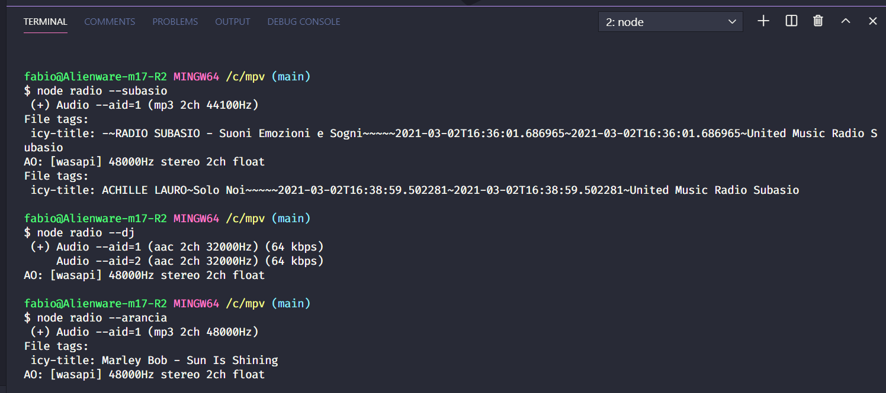

# Radio [](https://www.travis-ci.com/Dragod/Radio)
### Listen your favourite Web Radio from CLI, on Windows 10.



> Dependencies: [Mpv player](https://mpv.io/installation).
This nodejs script won't work without mpv player. You can change the audio player to VLC or mplayer if you like in the ```default.json```.
---
***How it works***

- Install mpv plarer ```choco install mpv```, make sure to add an environment variable, usually if you install through choco it does that on it's own. Now you should be able to run mvp player from anywehere in the terminal.

- Run ```npm i```

- Run ```node radio --yourRadioName```
---
***Default Web Radio flags***
> You can change them in default.json to match your favourite radio.

- Radio 105 Network ```--cc```
- Rtl 102.5 ```--rtl```
- Virgin Radio ```--virgin```
- Radio Italia ```--italia```
- Radio Subasio ```--subasio```
- Radio Montercarlo 2 ```--mc2```
- Rai Radio 1```--rai1```
- Rai Radio 2 ```--rai2```
- Rai Radio 3 ```--rai3```
- Radio Dimensione Suono ```--rds```
- Radio M2o ```--m2o```
- Radio Kiss Kiss ```--kiss```
- Radio Sport ```--sport```
- Radio 70-80-90 ```--r789```
- Radio Latte e Miele ```--latte```
- Radio Arancia Network ```--arancia```

Example: ```node radio --arancia``` will start streaming web Radio from Arancia Network.

> NOTE: CLI arguments, web radio & player are hardcoded in javascript files, but you can easily change them to suits your needs.